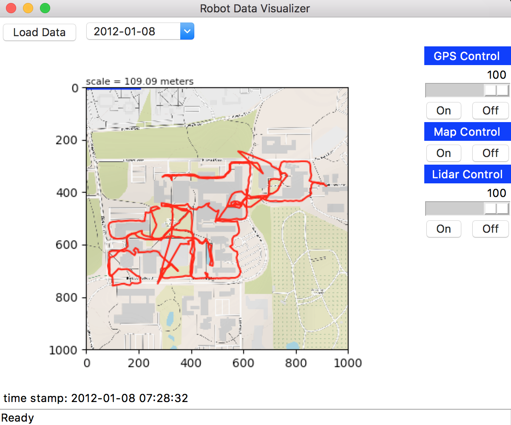

[](https://travis-ci.org/klatimer/robot-data-visualizer)


## Overview

This project was started with the intention of providing an easy tool for
visualizing robotics data. Currently, only the University of Michigan's
NCLT data set is used, which can be found here: http://robots.engin.umich.edu/nclt/

## Structure
    robot-data-visualizer/
      |- README.md
      |- gui/
         |- robot_data_visualizer.py
      |- test/
         |- run_test.py
         |- test_data_loader.py
         |- test_data_manager.py
         |- ...
      |- tools/
         |- __init__.py
         |- data_loader.py
         |- data_manager.py
         |- download_tar.py
         |- ...
      |- docs/
         |- ...
         |- Makefile
         |- make.bat
         |- _build/
            |- ...
         |- index.rst
         |- ...
      |- setup.py
      |- .gitignore
      |- .travis.yml
      |- LICENSE
      |- requirements.txt
      |- environment.yml

## Getting Started

### Installing from source

The official distribution is on GitHub, and you can clone the repository using:
```bash
> git clone https://github.com/klatimer/robot-data-visualizer
```
Then you need to go to the project's root directory by typing `cd robot-data-visualizer`.

#### Setup dependencies
To install all the dependencies, you have two options.

Option 1: Use pip to install all dependencies.
```bash
> pip install -r requirements.txt
```

Option 2: Use virtual environment 
```bash
> source activate environment.yml
```

To install the package, you can type:
```bash
> python setup.py install
```

### Tests
Tests can be run manually from the project root directory by typing:
```bash
> python test/run_tests.py
``` 
We are using Travis CI to run these tests after every commit. You can check out the current status 
[here](https://travis-ci.org/klatimer/robot-data-visualizer) or see the status in the badge at the top of this README.

## Tutorial


### To visualize GPS data:


First type `cd gui` at root directory of this project to go to gui directory, then type
```bash
> python robot_data_visualizer.py
```

Then you can see a graphic user interface here:


To use this GUI, you can follow the instructions here:
* Choose date of the data set then press the `Load Data` button in the toolbar.
* Wait for the data to be loaded. This may take a minute on the first try.
* Press `On` or `Off` button in GPS Control to show or remove that path. Also you can drag the slider to see gps path at different points in time.
* Press `On` or `Off` button in Map Control to show or remove the static map overlay.
* Press `On` or `Off` button in Lidar Control to switch to or from the lidar viewing mode. Note
that this may take a minute on the first try because lidar data is loaded once the `On` button
is pressed.

GPS Control `On` and Map Control `On`:


Lidar Control `On`:


## Documentation
Our project documentation can be found [here](https://wh1210.github.io/documentation/).

## License
This project utilizes the [MIT LICENSE](LICENSE).


